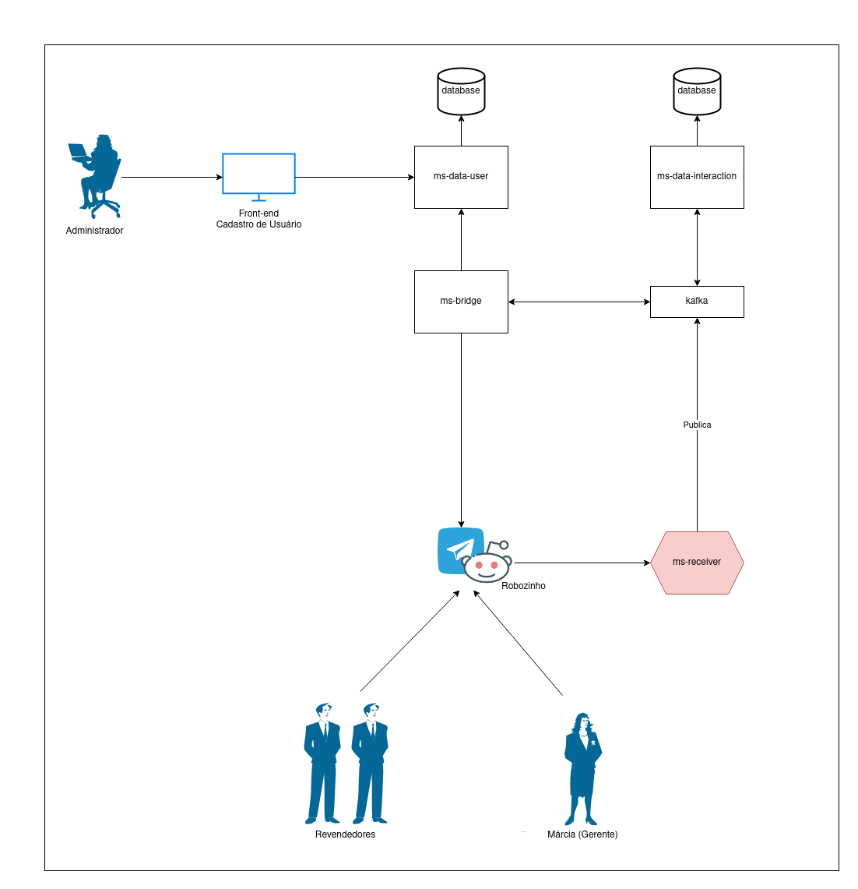

# hexagonal-demo

Aplicação desenvolvida durante na III STI e palestrada por [@soterocra](https://github.com/soterocra)

## Arquitetura Hexagonal

Para nos contextualizar, um breve resumo sobre o padrão.

Também conhecida como Ports and Adapters, é um conjunto de diretivas para design de código que visa deixar o código das regras de negócio totalmente independente de infraestrutura, seja ela de entrada ou saída.


A camada mais interna depende apenas dela mesmo, o lado esquerda (entrada) e o lado esquerdo (saída), dependem do centro da aplicação (regras de negócio), mas o centro não depende das bordas.

Conseguimos isso através da Inversão de controle e Injeção de dependência. Em Java podemos utilizar frameworks como Spring IOC, CDI, entre outros.

Nessa abordagem o autor também cita a grande importância de um bom sistema de controle de dependências para que seja possível a interação fácil entre todas as peças de software. Um bom exemplo, que vamos utilizar aqui é o Maven, com seus recursos de submodules.

## Narrativa de Negócios

Bem, já sabemos como queremos construir nossas aplicações, vamos entender o que o time de negócios deseja para que tenhamos um caso prático para aplicação dos conceitos.

Márcia ocupa um cargo de Gerente Estadual em uma empresa que vende cosméticos. Márcia nos enviou um e-mail com a seguinte solicitação:

> Eu, enquanto gerente estadual de uma grande empresa de cosméticos, preciso de um canal rápido e fácil em que seja possível que os meus revendedores municipais me enviem propostas de compras com desconto solicitados por nossos clientes.

Além disso, ela descreveu os seguintes requisitos:

> Eu preciso:
> * Conseguir enviar comunicados
> * Conseguir aprovar ou negar uma proposta de compra abaixo do preço tabelado
> 
> Os meus revendedores precisam:
> * Conseguir ler meus comunicados
> * Submeter propostas para aprovação

Para finalizar, Márcia acrescentou no e-mail o seguinte comentário: 

> Hoje já fazemos essa comunicação por chat via whatsapp ou telegram, gostaria que continuasse assim, porém um pouco mais automático.

Bem, agora que temos os requisitos do time de negócio, vamos trabalhar na nossa solução.

## Pensando na Solução

Como Márcia e seu time já utilizam aplicativos de chat para se comunicar, podemos nos aproveitar disso, mais especificamente do Telegram que possui formas gratuitas de integração.

Bem, mas como usar o telegram para resolver essa situação?

**Vamos utilizar BOTs!!**

Isso mesmo, um robô (ou mais) que fazem a comunicação entre o time, utilizando o próprio Telegram.

Não sabe o que são BOTs? Dê uma olhadinha no site do telegram: https://core.telegram.org/bots

Em algum momento você já deve ter utilizado, são aqueles robôs de comunicação.

### Como funciona nossa solução?

Esse desenho representa o que é e como funciona nossa solução:



Como vemos acima é uma solução completa de ponta a ponta, desacoplada e utilizando microservice.

Se lembre, o foco deve ser no microservice receiver, que está no formato hexagonal.

Na nossa solução, temos revendedores pedindo descontos para seus chefes, os chefes respondendo, e nossa equipe administrativa controlando os acessos em um painel web, legal né?

**Vamos colocar a mão na massa?** 

Garanta que você está na branch sem o microservice receiver, ou exclua a pasta. De dentro da pasta app execute os seguintes comandos:

`mvnw archetype:generate -DgroupId=lab.soterocra.hexagonal -DartifactId=ms-proposta-rapida-receiver -DinteractiveMode=false`

Agora, acesse a pasta gerada pelo terminal e execute:

`mvnw archetype:generate -DgroupId=lab.soterocra.hexagonal -DartifactId=proposta-rapida-receiver-core -DinteractiveMode=false`

Nesse projeto gerado, do core, altere o junit para a versão mais nova.
```xml
<dependency>
    <groupId>org.junit.jupiter</groupId>
    <artifactId>junit-jupiter-api</artifactId>
    <version>5.7.2</version>
    <scope>test</scope>
</dependency>
```

Execute para criar o app, que vai ter nosso framework de injeção de dependência:

`mvnw archetype:generate -DgroupId=lab.soterocra.hexagonal -DartifactId=proposta-rapida-receiver-app -DinteractiveMode=false`

Adapter do Telegram:
`
mvnw archetype:generate -DgroupId=lab.soterocra.hexagonal -DartifactId=./adapters/proposta-rapida-receiver-webhook-telegram -DinteractiveMode=false
`

Antes de fazer o adapter de saída do Kafka, vamos as configurações do module app:

Implementação Inicial das Coonfigurações:

```java
package lab.soterocra.hexagonal;

import lab.soterocra.hexagonal.domain.model.Message;
import lab.soterocra.hexagonal.ports.in.ReceiverPort;
import lab.soterocra.hexagonal.ports.out.PostMessagePort;
import lab.soterocra.hexagonal.usecase.SendMessageToSystemUseCase;
import org.springframework.context.annotation.Bean;
import org.springframework.context.annotation.ComponentScan;
import org.springframework.context.annotation.Configuration;

@Configuration
@ComponentScan(basePackages = "lab.soterocra.hexagonal")
public class PropostaRapidaConfiguration {

    @Bean
    public ReceiverPort receiverPort() {
        return new SendMessageToSystemUseCase(postMessagePort());
    }

    @Bean
    public PostMessagePort postMessagePort() {
        return new PostMessagePort() {
            @Override
            public void sendMessage(Message message) {
                System.out.println("Minha mensagem: " + message.toString());
            }
        };
    }

}
```

O adapter de saída, podemos tirar o do telegram como base, basta copiar e colar, mudando o nome de acordo com o nome que já está no repositório final. Temos que mudar o artifactId e name dentro do pom também!

Os demais passos veremos durante nossa aula! Em breve mais detalhes em texto e em vídeo aqui no repositório para o restante da comunidade.